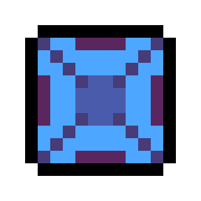
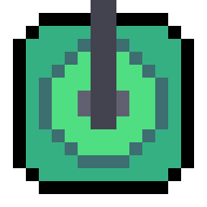
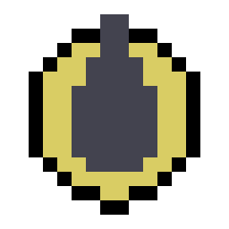
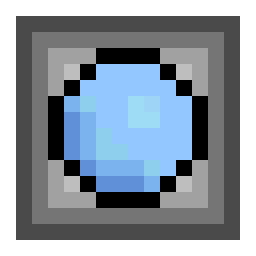
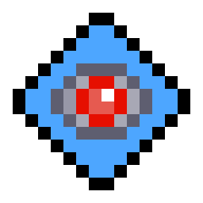
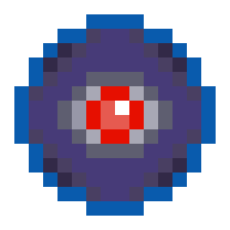
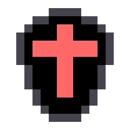

# BasicTD

## 遊戲特色

這款塔防遊戲擁有許多塔防的基本要素，你將需要組合所有防禦塔的強大特性，抵禦來自神祕源頭的攻擊。

每一種塔都有 4 項不同的升級屬性，可以對敵軍造成不同面向的打擊。而你需要妥善運用資源，發揮最大的防禦效益。

## 遊玩方法

按下畫面正中央的按鈕即可開始選擇關卡。進入關卡後，左邊是地圖，右邊是資料面板，資料面板最上方是自然精華碇，也是這個遊戲的主要資源，在他的下方有一個綠色建築，表示玩家的血量。我們可以點擊地圖中的空白區域，此時資料面板會顯示可以建造的防禦塔。如果底色為紅色，表示你無法建造，反之如果是灰色則可以建造。

點擊你的防禦塔可以進行看到防禦塔的可升級屬性與攻擊範圍。按下加號的按鈕可以升級該屬性。升級會越來越貴，不同的升級有不同的計算公式，你需要妥善運用資源。

## 防禦塔

### 基礎塔

> 基礎塔的攻擊速度很快，並且升級相對便宜，可以在初期有效的幫助玩家抵禦敵人。

### 狙擊塔

> 狙擊塔的攻擊速度很慢，但是他是唯一可以剝掉敵方護甲的防禦塔，擅長抵禦騎士(見敵人)。

### 炸彈塔

> 炸彈塔可以提供範圍攻擊，同時也是DPS最高的防禦塔，攻擊護盾的同時可以傷害到敵人血量，擅長攻擊眼睛(見敵人)。

### 特斯拉

> 特斯拉會同時攻擊到範圍內的所有敵人，並延長護盾回復時間。

## 敵人

敵人主要分為三種，並分別有進化後的 Boss 單位。

<table>
<td>
<tr>

</tr>
<tr>

</tr>
</td>
</table>

### 憨臉

> 沒有護盾與護甲，走路速度普通，在第 100 波後會進化為憤怒憨臉。

<table>
<td>
<tr>

</tr>
<tr>

</tr>
</td>
</table>

### 邪眼

> 擁有恢復速度非常快的大量護盾，在第 125 波後進化為渾沌之眼。

<table>
<td>
<tr>

</tr>
<tr>

</tr>
</td>
</table>

### 白騎士盾

> 擁有高護甲與恢復速度中等的少量護盾，在第 150 波後進化為黑騎士盾。

在 100 波後，每25波會出現一波 Boss 單位，如果沒有及時處理，將會大幅提高接下來的難度。

## Update Log

- 2023/7/24 新增設定功能，防禦塔建造範圍預覽，與敵人資訊。
- 2023/7/23 新增關卡編輯器功能
- 2023/7/22 新增 Boss 單位
- 2023/7/21 Alpha 0.2 新增第四個塔 Tesla Tower 專門對付帶盾的敵人，並新增三種新的敵人。
- 2023/7/20 遊戲封閉測試版 Alpha 0.1 完成。
- 2023/7/12 專案建立